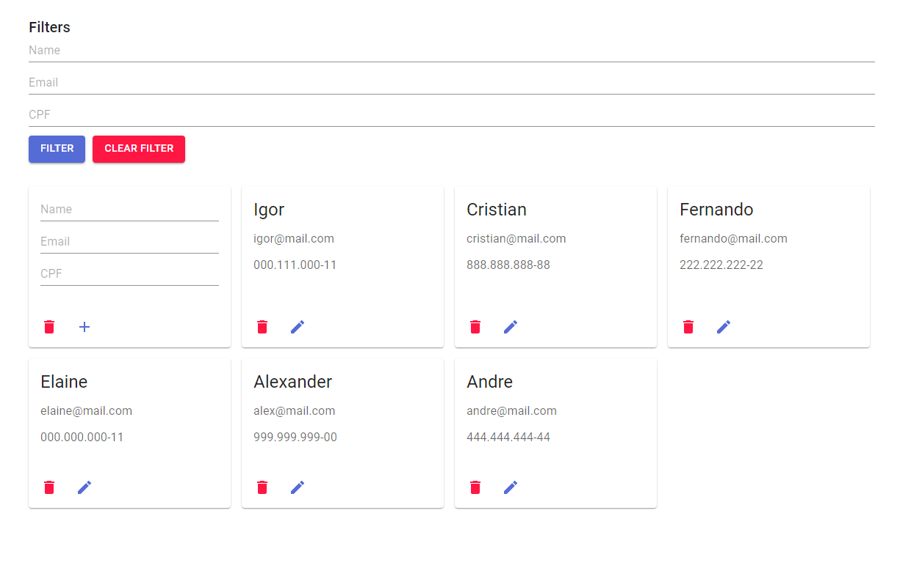

# Desafio Tecnico Assincrono  -  Descomplica

## Proposta
- [x] Desenvolver um serviço com API GraphQL que consuma um banco de dados de
alunos contendo: nome, CPF e e-mail.
  - [x] A API deve listar os alunos filtrando por quaisquer dos campos, retornando
todos, caso nenhum seja informado.

- [x] Desenvolver uma UI em React que nos permita realizar consultas a esse serviço,
consumindo e exibindo os dados retornados por ele.

## Requisitos não funcionais
- [x] Ser escrito em JavaScript ou TypeScript
- [x] Tanto o serviço no backend quanto a UI serem servidos em containers Docker
- [x] O banco de dados deve ser implementado num SGBD, como MySQL, Postgres ou
similares.
- [x] Haver documentação (instruções sobre como devemos rodar seu projeto, por
exemplo, são indispensáveis)

## Você se destacará se...
- [x] Adicionar, editar ou excluir alunos via React app
- [x] Realizar commits específicos e detalhados
- [ ] Escrever testes automatizados
- [X] Acrescentar algum tipo de cache para a consulta dos dados (no frontend, no
backend, ou nos dois :)
- [x] Acrescentar um proxy reverso redirecionando as requisições que chegam para o
serviço
- [x] Disponibilizar uma solução completa para o deploy da aplicação (helm chart,
docker-compose)

-----


## Setup

1. Rode o comando abaixo
```
docker-compose up --build
```

2. Acesse a UI pelo endereço
```
http://localhost
```

3. Graphql endpoint é localizado no endereço
```
http://localhost/graphql
```
## Resultado



# Desenvolvimento
As instruções abaixo são para executar os ambientes em modo de desenvolvimento.

## Client
1. acesse o diretorio do client 
```
$ cd client
```
2. instale as dependencias 
```
$ yarn
```
3. execute o projeto em modo desenvolvimento com o comando 
```
$ yarn dev
```


## Server
1. acesse o diretorio do client 
```
$ cd server
```
2. instale as dependencias 
```
$ npm install
```
3. execute o projeto em modo desenvolvimento com o comando 
```
$ npm run dev
```

4. Ao executar sem o docker-compose o banco de dados não é criado automaticamente, você precisa configurar um banco de dados SQL (utilizei postgres para o projeto)

Crie um arquivo ```.env``` e adicione as variaveis de ambiente
```
PGHOST=node_db
PORT=4848
```


